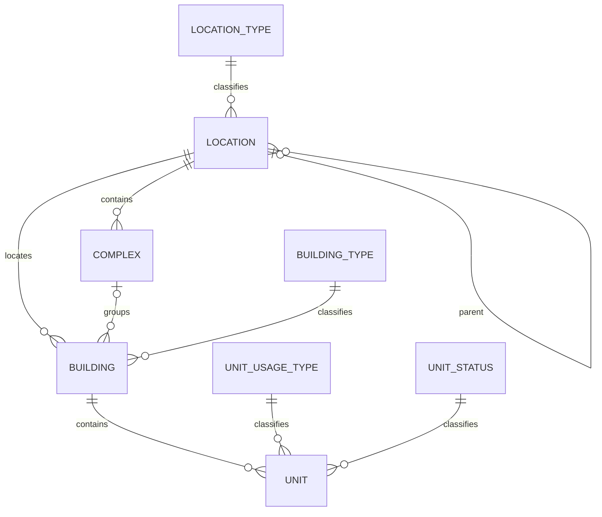

# Physical Structure Data Model

Physical-structure tables live in the short SQL Server schema `bms`. Addressable aggregate entities use an internal `bigint IDENTITY` primary key, immutable public `varchar(5) Code`, activation, UTC audit timestamps, and rowversion. Foreign keys are internal bigints. The API never exposes numeric keys and resolves aggregate relationships from public codes.

Public codes:

- are generated cryptographically by the application from `A-Z` and `0-9`;
- contain exactly five characters;
- are normalized to uppercase;
- have database format constraints and a unique index in every table;
- are immutable after creation;
- are unique within the resource table, while the route identifies the resource type.

- **Reference data:** LocationType, BuildingType, UnitUsageType, and UnitStatus use internal igint IDENTITY, a stable unique lowercase Key, Persian Title, ordering, activation, audit timestamps, and rowversion. They intentionally have no random public Code. LocationType may reference a parent type.
- **Location:** nullable numeric parent FK, display/normalized name and location-type FK. No self-parent; sibling name/type unique. API uses parentCode and locationTypeKey.
- **Complex:** required numeric location FK, name, address/postal code, optional coordinates/description. API uses `locationCode`.
- **Building:** required location FK, optional complex FK, physical details and building-type FK. Complex/building locations must match. API uses `locationCode`, optional `complexCode`, and `buildingTypeKey`.
- **Unit:** required building FK, display/normalized unit number, physical counts, usage-type/status FKs. Unit number remains unique per building. API uses `buildingCode`, `usageTypeKey`, and `statusKey`.

Deletes are restricted. Future names, schemas not final: Party, User, UnitPartyRelation, BuildingRole, AssetType, BuildingAsset, BuildingAssetEvent, BuildingAssetSchedule, BuildingAssetScheduleNotificationRecipient, BuildingPeriod, ExpenseType, BuildingExpenseTypeSetting, BuildingPeriodExpenseDetail, ExpenseDistribution, BuildingPeriodCharge, UnitAccount, LedgerTransaction, Payment, Notification, Attachment.

## Migration baseline

The pre-Phase-2 migration history is squashed into one `InitialCreate` migration with a generated EF Core Model Snapshot. New development databases should be created from this baseline. An existing development database created by the previous three-migration chain must either be recreated or have its migration-history rows re-baselined without rerunning schema creation.
