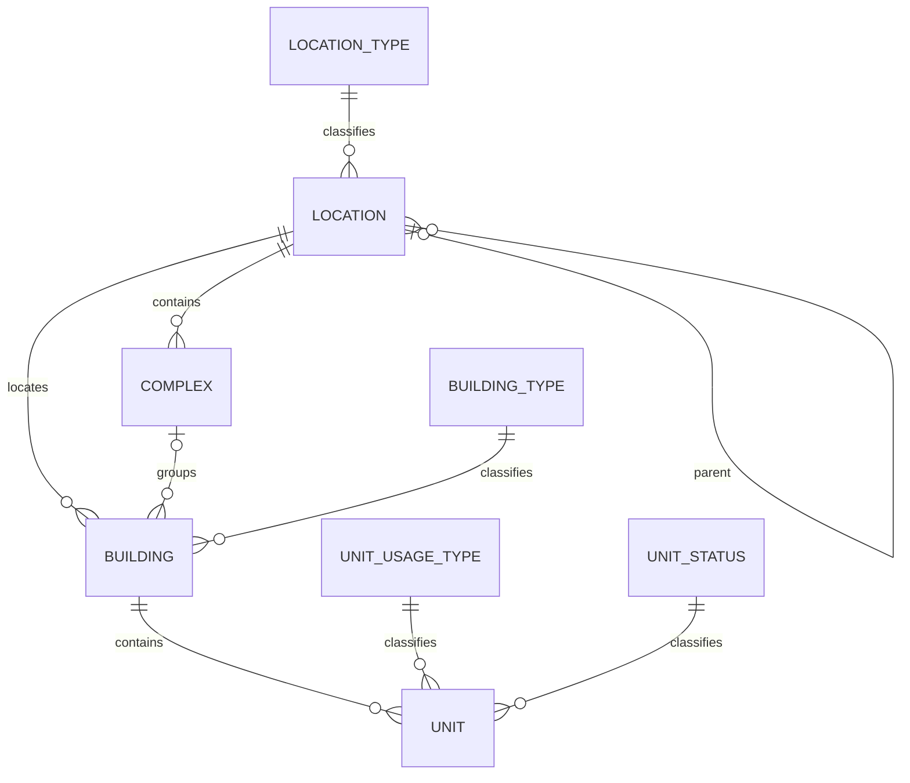

# Physical Structure Data Model

Physical-structure tables live in the short SQL Server schema `bms`. Addressable aggregate entities use an internal `bigint IDENTITY` primary key, immutable public `varchar(5) Code`, activation, UTC audit timestamps, and rowversion. Foreign keys are internal bigints. The API never exposes numeric keys and resolves aggregate relationships from public codes.

Public codes:

- are generated cryptographically by the application from `A-Z` and `0-9`;
- contain exactly five characters;
- are normalized to uppercase;
- have database format constraints and a unique index in every table;
- are immutable after creation;
- are unique within the resource table, while the route identifies the resource type.

- **Reference data:** LocationType, BuildingType, UnitUsageType, and UnitStatus use internal igint IDENTITY, a stable unique lowercase Key, Persian Title, ordering, activation, audit timestamps, and rowversion. They intentionally have no random public Code. LocationType may reference a parent type.
- **Location:** nullable numeric parent FK, display/normalized name and location-type FK. No self-parent; sibling name/type unique. API uses parentCode and locationTypeKey.
- **Complex:** required numeric location FK, name, address/postal code, optional coordinates/description. API uses `locationCode`.
- **Building:** required location FK, optional complex FK, physical details and building-type FK. Complex/building locations must match. API uses `locationCode`, optional `complexCode`, and `buildingTypeKey`.
- **Unit:** required building FK, display/normalized unit number, physical counts, usage-type/status FKs. Unit number remains unique per building. API uses `buildingCode`, `usageTypeKey`, and `statusKey`.

## Party and occupancy

Party data uses the database default schema: `PartyTypes`, `Parties`, `PartyContactTypes`, and
`PartyContacts`. A Party requires only `PartyType` and `DisplayName`; contacts and the directly
stored `Party.IdentityNumber` are optional. IdentityNumber is omitted from list/search responses.
PartyContact is an internal child row without a public Code; verification fields remain available.

Unit-scoped feature tables use the database default schema: `UnitPartyRelationTypes`,
`UnitPartyRelations`, and `UnitOccupancyHistories`. Relations use internal Ids, real FKs and
restricted deletes; they have no public Code, ownership share, or payment-contact flags.
Relationship dates may be null when unknown. Occupancy effective dates may likewise be null.
At most one active open occupancy-history row exists per Unit through a filtered unique index.

For UnitPartyRelation, `EndDate = null` means ongoing and a non-null EndDate means ended.
`IsActive` is only the soft-delete flag. Preferred contact selection remains on
`PartyContact.IsPrimary` and is not duplicated on the Unit relation.

`Unit.CurrentOccupantsCount` is non-negative and is the current snapshot. Zero derives
`vacant`; a positive value derives `occupied`. The snapshot and open history row are written
in one transaction. An occupied Unit requires an active tenant/resident relation; a vacant
Unit has no active occupancy relation but may retain ownership.

Deletes are restricted. Future names and schemas for unrelated domains are not final. The approved Asset design does not include AssetSchedule, schedule-notification recipients, reminders, or notifications; suggested review dates remain derived data only.

## Migration baseline

The pre-Phase-2 migration history is squashed into one `InitialCreate` migration with a generated EF Core Model Snapshot. New development databases should be created from this baseline. An existing development database created by the previous three-migration chain must either be recreated or have its migration-history rows re-baselined without rerunning schema creation.

## File management

- `base.StoredFiles` contains storage-neutral metadata and a table-unique public code.
- `bms.BuildingGalleryFiles` and `bms.ComplexGalleryFiles` link images to their real owners; a filtered unique index permits at most one active cover per owner.
- `bms.DocumentTypes` is key-based reference data and intentionally has no public code.
- `bms.BuildingDocuments` and `bms.ComplexDocuments` link document metadata, file, owner, and document type through real foreign keys.
- Relationship rows and stored files use internal `bigint IDENTITY` keys. HTTP contracts expose only public codes or document-type keys.
- Deleting a relationship removes it and deactivates/deletes an orphaned stored file; file bytes are never served directly from disk.
