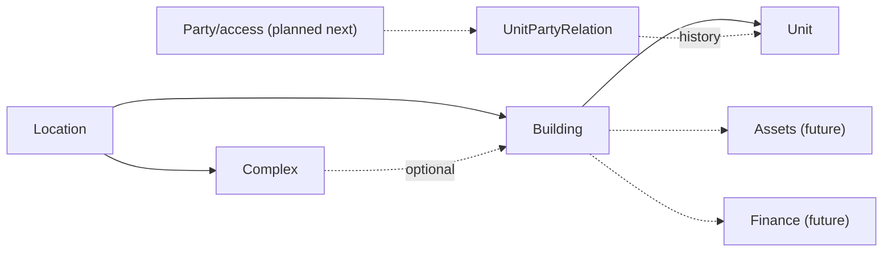

# Domain Overview

## Implemented Now

## Planned Next

Party, User invitation/link, historical UnitPartyRelation, roles, authorization, organization isolation.

## Future

Assets/events/schedules; periods, expenses, charges, allocations, ledger; payments, notifications, files, reports, localization, multi-currency.

Party is real-world identity; User is login identity. Charge, Expense, Payment, and LedgerTransaction remain distinct. Events are historical; schedules are prospective with multiple recipients.

## Unresolved Decisions

Authorization/organization model, deep location cycles, party deduplication, finance snapshots, currencies/locales, providers, bulk import, asset categories.
