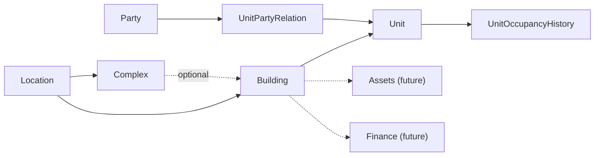

# Domain Overview

## Implemented Now

## Party and occupancy

Party is implemented as reusable real-world identity with optional contacts and identifiers.
UnitPartyRelation preserves independent owner, tenant, resident, representative, and contact
facts. Unit stores the current occupants count for fast reads while UnitOccupancyHistory
preserves periods. Occupancy changes update both inside one SQL transaction.

## Planned Next

User invitation/link, roles, authorization, and organization isolation.

## Future

Assets/events/schedules; periods, expenses, charges, allocations, ledger; payments, notifications, files, reports, localization, multi-currency.

Party is real-world identity; User is login identity. Charge, Expense, Payment, and LedgerTransaction remain distinct. Events are historical; schedules are prospective with multiple recipients.

## Unresolved Decisions

Authorization/organization model, deep location cycles, party deduplication, finance snapshots, currencies/locales, providers, bulk import, asset categories.
