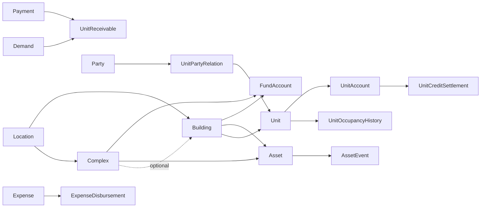

# Domain Overview

Implemented feature areas are Physical Structure, Files, Party/Occupancy, Assets and Finance.

## Boundaries

- Party is real-world identity; future User is login identity.
- StoredFile metadata is shared, while each file relation validates its parent scope.
- AssetEvent cost is informational and does not create Expense.
- Expense/Demand use explicit Asset/Event links only for traceability.
- Credit belongs to Unit, never Party.
- No generic polymorphic `EntityType/EntityId` links exist.

## Not implemented

User/Invitation/authentication/authorization, tenant isolation, notifications, schedules, reporting/BI, localization tables, real gateway adapters, refunds/reversals and advanced multi-currency accounting.

Read `project-context.md` for complete onboarding and `implementation-history.md` for the decision sequence.
